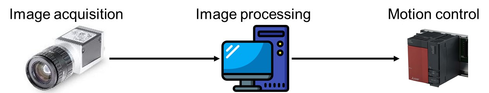
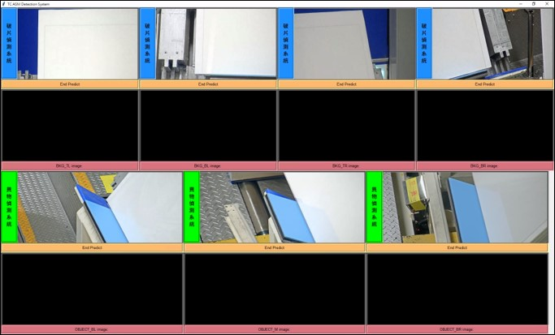

# Defect-image-recognition-system
Deliver a vision detection system to detect the defect.

## The development consists four different stages:
* Phase 1. Web camera setup: adding one additional camera to observe the defect
* Phase 2. PC server setup & PLC network module installation: PC-PLC connection
* Phase 3. Data collection: collect the image for detection system module training
* Phase 4. Robot new path design & implement new program/debug
* Phase 5. GUI design for image recognition system

Experiment objective is to collect the data to train deep learning model for online monitoring and auto-classification. 
The data collection will use the webcam setup online. After PC-PLC connection complete, will design new path for robot to do automation.

